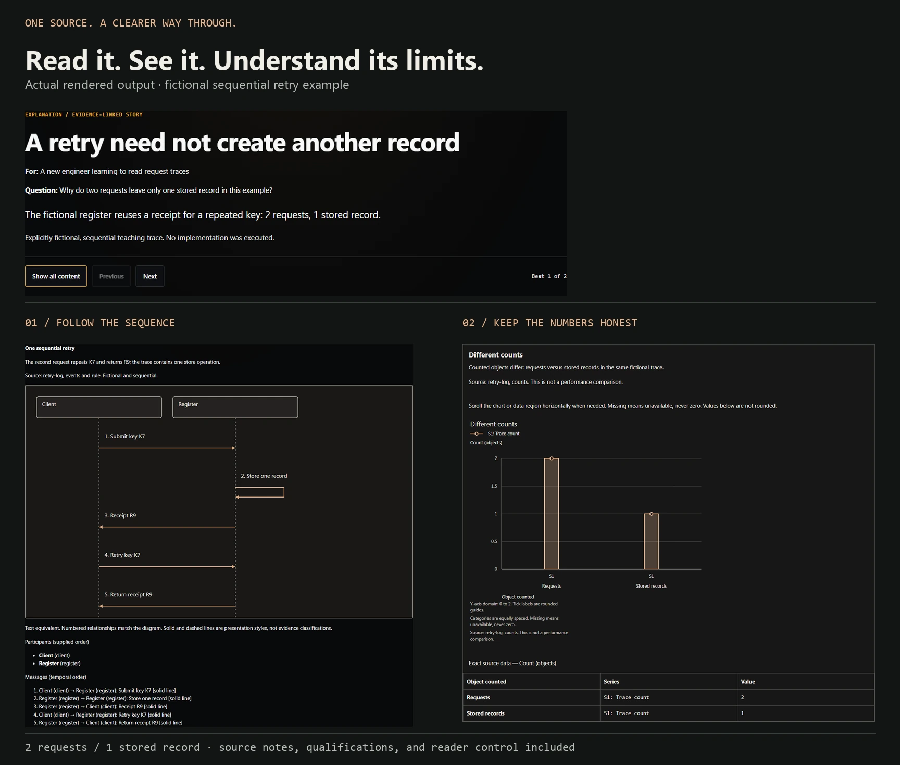

<p align="center">
  
</p>

# STE-Pro Max

**Turn source material into something people can understand.**

Clear writing. Technical diagrams. Faithful charts. Reader-controlled stories.
One native engine and three focused skills for **GitHub Copilot CLI, Claude Code,
and Codex**.

[Start here](#start-here) · [See the outputs](#see-the-outputs) · [Try a prompt](#try-a-prompt) · [Use with your agent](#use-with-your-agent) · [Full coverage](#what-you-can-create) · [Docs](#go-deeper)

---

## Start here

**Already in this checkout? One command:**

```sh
python quickstart.py --open
```

You get a real, local example: **“A check is not an approval.”** It includes an
explanation, a visual, a reader check, and the evidence behind it. No API key.
No output-folder naming. No account to create for the renderer.

The launcher reuses a ready Python environment or prepares an isolated one in
this workspace. **First-time setup may download the declared Python packages.**
It never installs into global Python. Opening the browser is explicit: omit
`--open` for headless work, or add `--no-install` to prohibit package installation.

<details>
<summary><strong>First time? Get the current preview branch</strong></summary>

Python **3.10+**, Git, and access to this repository are required.

```sh
git clone --branch feat/comprehensive-suite --single-branch https://github.com/shyamsridhar123/STE-Pro-Max.git
cd STE-Pro-Max
python quickstart.py --open
```

This preview lives on `feat/comprehensive-suite`; the unmerged default branch
is not an equivalent installation. On systems where Python is named `python3`,
use that executable instead.

</details>

### Bring your own source

```sh
python quickstart.py notes.md --open
```

Already have Jinja2 and PyYAML in your environment?

```sh
python -m ste_promax start notes.md --open
```

Each run chooses a **fresh folder in `artifacts/`**, preserves the original input,
and gives you the result path. Your notes are never overwritten.

Need setup diagnostics? Run `python -m ste_promax doctor`.
It checks; it does not install.

## See the outputs



*Real rendered examples—not generated product screenshots. The hero above is
conceptual artwork made with GPT Image 2.5; the examples use labeled fictional
source material.*

| Start with | Get | Example source |
| --- | --- | --- |
| Technical notes | A clear explanation with message order and a check question | [One retry, one stored record](examples/suite/retry-explanation.json) |
| Options and constraints | A decision brief that keeps unresolved conditions visible | [Workshop decision](examples/suite/workshop-decision.json) |
| Research notes | Attributed findings, method limits, and qualified implications | [Research digest](examples/suite/instruction-research.json) |
| An incident timeline | Observations separated from hypotheses and proposals | [Queue incident](examples/suite/queue-incident.json) |
| Relationships and quantities | Labeled diagrams, charts, and complete text/data equivalents | [Visual reference](examples/suite/caption-documentation.json) |

Run any example with `python -m ste_promax start <path> --open`.
More: [example guide](examples/suite/README.md) · [interactive Clarity Lab source](examples/clarity-lab/explanation.html).

## Try a prompt

Use these in a host where the plugin's skills are loaded. Supply your actual
source material; the agent handles the format and rendering mechanics.

**Make the writing clearer**

> Use STE-ProMAX to rewrite these release notes for a delivery lead. Keep every
> qualification and number. Return the rewrite, not an editing report.

**Explain a technical system**

> Use STE visual documentation to explain this retry flow. Show the message order,
> preserve the failure conditions, and include a text equivalent.

**Build an evidence-backed story**

> Use STE storytelling to turn these findings into a decision brief. Separate
> observations, inferences, and proposals. Keep unresolved questions visible.

**Choose the useful format for me**

> Use STE-Pro Max to explain this material for a new engineer. Pick the smallest
> useful format, create the artifact, and show me the result. Don't invent evidence.

A short rewrite stays a short rewrite. You do not have to select a schema, theme,
or output path. The agent asks only when a missing fact or consequential choice
changes the result—not to make you operate the tools.

## Use with your agent

The same source bundle contains **three skills**:

| Skill | Best for |
| --- | --- |
| `ste-promax` | Clear technical and executive writing; choosing the useful medium |
| `ste-visual-docs` | Flow/sequence diagrams, bar/line charts, technical references |
| `ste-storytelling` | Explanations, decision briefs, research digests, incident reviews |

Use the **absolute path to this checkout** when loading from another workspace:

| Host | Low-friction local path |
| --- | --- |
| **GitHub Copilot CLI** | `copilot --plugin-dir "<absolute-checkout>"` for the session |
| **Claude Code** | `claude --plugin-dir "<absolute-checkout>"` for the session |
| **Codex CLI** | `codex plugin marketplace add "<absolute-checkout>"`, then `/plugins` to install |
| **Codex desktop** | Use the documented local Plugins Directory flow; see the host guide |

Plugin discovery and Python readiness are separate. Set up the renderer in the
workspace once; do not modify a shared plugin cache or global environment.
**No automatic hooks, background service, MCP server, or provider credentials.**

[Detailed host setup, persistent installation, and exact validation limits →](docs/PLUGINS.md)

## What you can create

| Capability | Included | Important boundary |
| --- | --- | --- |
| **Writing** | Flexible STE-inspired prose; advisory length checks | No automatic fact-checking or STE certification |
| **Diagrams** | Flow/component and sequence views; feedback and self-links; SVG | Sequence spacing shows order, not measured time |
| **Charts** | Bars and categorical lines; units, missing values, supplied bounds | No invented data, continuous time scale, or computed confidence interval |
| **Stories** | Audience, question, typed claims, source IDs, ordered beats, reader checks | Source linkage is not proof of truth or causation |
| **Interactive documents** | Guided/all-content views, keyboard navigation, printable answers | Custom executable HTML needs explicit trust |
| **Narration** | Local Windows speech or supplied PCM; measured timing, captions, transcript | Preparation is not an MP4 or a listening review |
| **Video path** | Prepared HyperFrames composition and a verified example export | Optional installed tooling and final-preview approval required |
| **Portable delivery** | Source plugin and Python wheel; cross-directory execution | Host installation/runtime support is verified separately |

### One source. Useful companions.

A story can produce:

```text
source.json          Original, unchanged
input.json           Normalized input
*.html               Readable, interactive explanation
visual-*.svg         Editable structured visuals
story.md             Prose and text/data equivalents
storyboard.json      Ordered beats and visuals
narration.json       Draft narration cues
evidence.json        Claims, sources, and qualifications
manifest.json        File hashes and review warnings
```

The design, metadata, and local gallery are included too. Keep the explanation
and qualifications with any exported visual.

<details>
<summary><strong>CLI reference: human-friendly by default, JSON for agents</strong></summary>

| Command | Job |
| --- | --- |
| `start [file]` | Render a source, or try the built-in fictional demo; choose a fresh output folder |
| `doctor [--json]` | Diagnose Python, dependencies, and optional media tools without changes |
| `check file.md --json` | Advisory writing diagnostics; original stays unchanged |
| `schema story` | Inspect a supported shape and runnable example |
| `render file --output-dir path` | Explicit artifact control; machine-readable result |
| `narrate story.json --output-dir path` | Prepare media using local speech or supplied beat WAVs |

`start` supports `--json`, `--open`, `--output-dir`, `--title`, `--design`, and
explicit `--trusted-html`. The lower-level commands remain available.

From another directory: `python "<bundle-root>" start "<absolute-source>" --json`.
For direct Markdown rendering, the CLI preserves your prose; the assistant's
writing skill performs the rewrite when requested.

</details>

<details>
<summary><strong>Narration and video</strong></summary>

```sh
python -m ste_promax narrate examples/suite/retry-explanation.json --output-dir artifacts/retry-media
hyperframes check artifacts/retry-media/video --json
hyperframes preview artifacts/retry-media/video
```

The first command uses an installed Windows voice. For a cross-platform path,
pass `--audio-dir <folder>` containing `<beat-id>.wav` for each beat.

The output includes real WAVs, measured timing, transcript, captions, source and
review companions. Open the **`video/` subdirectory** in HyperFrames, not the
outer evidence folder. Review the source, speech, visuals, and final preview
before exporting. No paid speech service is configured.

[Complete media workflow and export checks →](docs/AUTHORING.md#prepare-narration-without-claiming-an-export)

</details>

## Built to be checked

- Original source bytes and artifact hashes are retained.
- Duplicate JSON keys, lossy numbers, dangling references, and unsupported fields
  fail clearly instead of silently changing the story.
- Diagrams and charts include readable text/data equivalents and noncolor cues.
- Readers control progress; no-JavaScript and print paths remain available.
- The local renderer makes no model API call. Your assistant host's processing
  and privacy rules still apply.
- Convenience never grants permission to publish, upload, trust arbitrary HTML,
  or skip review of a consequential claim.

[Validation evidence and tested scope](docs/VALIDATION.md) · [Requirements audit](docs/SUITE_AUDIT.md)

## If something gets in the way

| Symptom | Next step |
| --- | --- |
| Python is not found | Install Python 3.10+; use `python3` if that is your system's command |
| Renderer dependencies are missing | Run `doctor`; use the explicit quickstart to prepare an isolated environment |
| An existing environment is refused | Keep it intact; use a fresh workspace or a known-ready interpreter |
| An output directory already exists | Use `start` without `--output-dir`, or choose a new directory |
| Raw HTML is rejected | Review it first; use `--trusted-html` only for deliberately trusted content |
| A private-repo install fails | Confirm GitHub access and use the preview branch/local-checkout path |
| Narration is unavailable | Supply PCM WAVs or use a local installed Windows voice; nothing switches to a cloud service |

## Go deeper

[Authoring guide](docs/AUTHORING.md) · [Plugin and runtime setup](docs/PLUGINS.md) ·
[Examples](examples/suite/README.md) · [Learning and storytelling research](docs/research/VISUAL_LEARNING_AND_STORYTELLING.md) ·
[Open Knowledge Format assessment](docs/research/OPEN_KNOWLEDGE_FORMAT.md) ·
[Source provenance](docs/PROVENANCE.md) · [Image provenance](docs/assets/README.md)

**License:** [Apache-2.0](LICENSE). Copyright © 2026 Shyam Sridhar and contributors.
STE-Pro Max is an STE-inspired house style, not ASD-STE100 certification.
