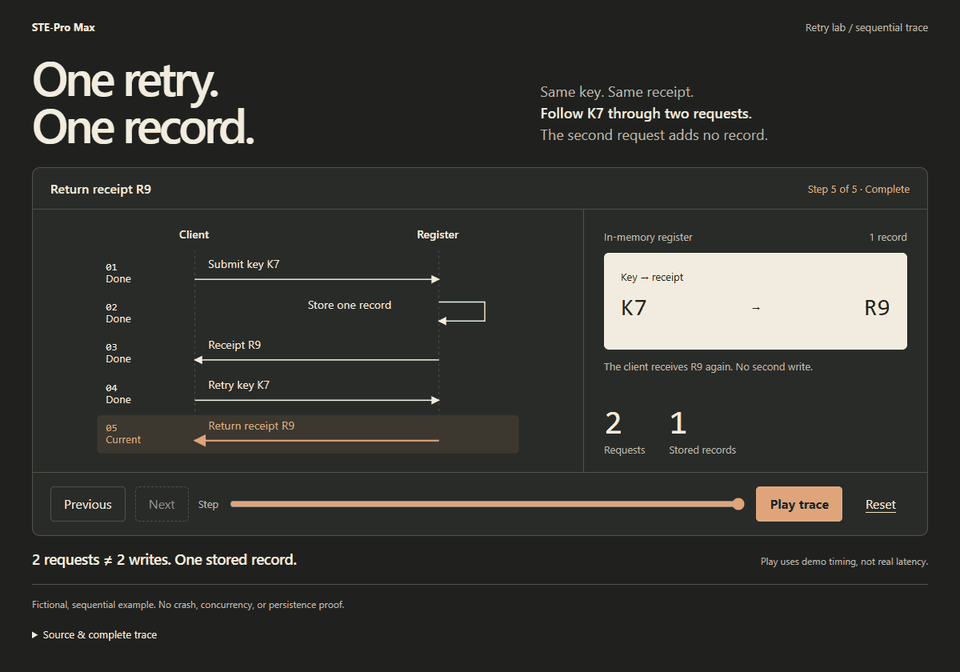
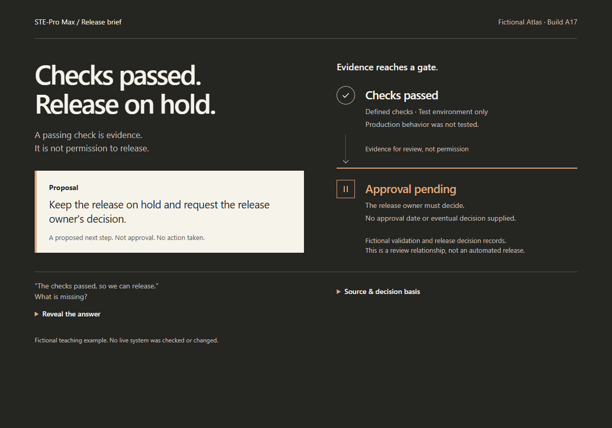

<p align="center">
  
</p>

# STE-Pro Max

**An agent plugin for explanations people can actually understand.**

Install in **GitHub Copilot CLI, Claude Code, or Codex**. Ask for a clearer rewrite,
a visual explanation, or an evidence-backed story. No Python or pip needed for
ordinary authoring—the plugin uses your agent’s existing tools.

[See it](#what-good-looks-like) · [Install](#install-the-plugin) · [Manage/update](docs/PLUGINS.md) · [Research](docs/research/PLUGIN_MANAGEMENT.md)

## What is STE?

**STE means Simplified Technical English**: a controlled language designed to make
technical writing easier to understand. It combines writing rules with a controlled
vocabulary. STE-Pro Max borrows the useful principles—clear sentences, consistent
terms, explicit meaning—without sacrificing facts or qualifications.
**This is an STE-inspired house style, not ASD-STE100 certification.** [Source](https://www.asd-ste100.org/about.html)

## Inspired by Karpathy’s guidelines

In his [October 2, 2026 post](https://x.com/karpathy/status/2105819303471976479),
Karpathy suggests improving how we understand model output: clearer STE-style
writing, diagrams, interactive HTML, and bespoke narrated explanations.

**Here:** rewrite clearly → show the mechanism → let readers explore → narrate
when useful. Choose the smallest useful medium; keep evidence and uncertainty
visible. The suggested “80%” relaxation is a style preference, not a score.
[What the post does—and doesn’t—say](skills/ste-promax/references/source-evidence.md).

## What good looks like

### One retry. One record.
> “Explain this retry flow so a new engineer can see why two requests need not mean two writes.”

[](examples/showcase/retry-lab.html)

Step, play, reset. Fictional and sequential—not a crash-safety guarantee. [Static preview](docs/assets/retry-lab.png).

| Checks passed. Release on hold. | A better number needs a better explanation. |
| --- | --- |
| [](examples/showcase/release-brief.html) | [](examples/showcase/rate-lab.html) |
| “Turn these records into a decision brief. Keep missing approval visible.” | “Explain 97.4% → 99.7%. Let me change the baseline.” |

**Real, working HTML—not generated UI mockups.** [Download the three examples](https://github.com/shyamsridhar123/STE-Pro-Max/releases/download/v0.4.0/ste-examples.zip),
unzip, and open any HTML file. No server or build. All example data is fictional.

## Install the plugin

Choose your host. These commands install the **v0.4.0 plugin persistently**, not a
temporary session or Python package. Restart the host after installation.

<details open>
<summary><strong>GitHub Copilot CLI</strong></summary>

```sh
copilot plugin marketplace add shyamsridhar123/STE-Pro-Max#v0.4.0
copilot plugin install ste-pro-max@ste-pro-max-plugins
```

</details>

<details>
<summary><strong>Claude Code</strong></summary>

```sh
claude plugin marketplace add shyamsridhar123/STE-Pro-Max#v0.4.0
claude plugin install ste-pro-max@ste-pro-max-plugins
```

</details>

<details>
<summary><strong>Codex CLI</strong></summary>

```sh
codex plugin marketplace add shyamsridhar123/STE-Pro-Max --ref v0.4.0
codex plugin add ste-pro-max@ste-pro-max-plugins
```

Use a version with `plugin add` (tested: 0.147.0). Older/supported desktop builds:
register the marketplace, then install through `/plugins` or the plugin browser.

</details>

Then ask:

> Use STE-Pro Max to explain this material for a new engineer. Pick the smallest
> useful format, preserve the evidence, and show me the result.

**Three skills:** `ste-promax` · `ste-visual-docs` · `ste-storytelling`.
Native managers own update, disable, and uninstall. [Lifecycle guide](docs/PLUGINS.md).
The pinned tag stays pinned; updates don’t silently select another release.

## What stays honest

Facts before polish. No invented causes or numbers. Source material is not permission
to execute or publish. The host’s normal model, tool, and privacy rules still apply.

The [optional Python engine](docs/AUTHORING.md) adds deterministic schemas and batch
rendering; it is **not required by the installed authoring skills**. Narration/video
needs a separately available media tool and review. [Tested scope](docs/VALIDATION.md).

[Examples](examples/showcase/README.md) · [Plugin research](docs/research/PLUGIN_MANAGEMENT.md) · [Image provenance](docs/assets/README.md) · [Apache-2.0](LICENSE)
