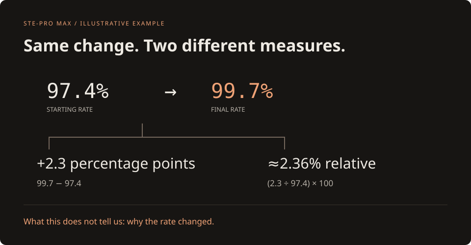

# STE-Pro Max

Clear explanations without factual drift—in prose, diagrams, interactive HTML,
or a narrated walkthrough.

The renderer is **copied and adapted directly from ATV-PaperBoard**. It runs inside
this repository; it does not wrap the installed `paperboard` CLI or depend on that
checkout. The original STE-ProMAX writing package remains unchanged.

**Plugin targets:** GitHub Copilot CLI, Claude Code, and Codex CLI/desktop. The
native manifests share three focused skills and the same Python engine.
See [plugin packaging and runtime requirements](docs/PLUGINS.md). No global host
installation or automatic dependency installation is performed.

## What is implemented

- **Flexible STE-inspired writing:** factual fidelity first, with an advisory
  checker for sentence and paragraph length. The approximate “80%” idea is a style
  preference, not a computed compliance score.
- **Technical diagrams:** native flow/component and sequence diagrams, including
  feedback and self-links, with editable inline SVG and complete text equivalents.
- **Quantitative documentation:** bar and categorical line charts with explicit
  units, missing values, source-provided uncertainty, and exact-value tables.
- **Evidence-linked storytelling:** audience, question, qualified claims, sources,
  ordered beats, reader-controlled navigation, and check questions. One source
  produces HTML, readable prose, a storyboard, narration cues, and an evidence ledger.
- **Interactive HTML:** native rendering, design and metadata sidecars, a local
  gallery, preserved inputs, and an explicit trust boundary for authored HTML.
- **Narrated explanations:** prepare a story using offline Windows speech or
  supplied PCM audio. The HyperFrames composition follows measured audio timing;
  preparation is not a movie export. ElevenLabs remains an optional, separately
  authorized alternative.
- **Oversight:** visible assumptions, source qualifications, and real output checks.
  Choose one useful medium; do not generate every format for every answer.

Read the [guideline-to-implementation map](docs/IMPLEMENTATION.md) and
[source evidence](skills/ste-promax/references/source-evidence.md).
The [authoring guide](docs/AUTHORING.md) explains the supported schemas and four
narrative recipes. [Research and its limits](docs/research/VISUAL_LEARNING_AND_STORYTELLING.md)
connect design decisions to primary evidence, without claiming measured learning gains.

## Run it

Python 3.10+ and PaperBoard's two existing Python dependencies, Jinja2 and PyYAML,
are required. From a checkout with those dependencies available:

```powershell
python -m ste_promax --help
python -m ste_promax schema story
python -m ste_promax schema diagram
python -m ste_promax schema chart
python -m ste_promax check examples/clarity-lab/source.md --profile relaxed --json
python -m ste_promax render examples/clarity-lab/source.md --output-dir artifacts/prose-demo
python -m ste_promax render examples/clarity-lab/explanation.html --trusted-html --title "Clarity Lab" --output-dir artifacts/clarity-lab-demo
```

Use a new output directory for each run. A successful render preserves its input
and produces HTML, a `.DESIGN.md`, a `.meta.yaml`, `gallery.html`, and a manifest.
Read the manifest: local design validation is not a factual or accessibility audit.

For an isolated installation on another machine:

```powershell
python -m venv .venv
.venv/Scripts/python.exe -m pip install -e .
.venv/Scripts/python.exe -m ste_promax --help
```

On macOS/Linux, the virtual environment's executable is `.venv/bin/python`.
The installed console command is `ste-promax`.

### Visual documentation and stories

```powershell
python -m ste_promax render examples/suite/caption-documentation.json --output-dir artifacts/visual-reference
python -m ste_promax render examples/suite/retry-explanation.json --output-dir artifacts/retry-story
```

Structured stories, diagrams, and charts do not need `--trusted-html`. Story
renders also write `story.md`, `storyboard.json`, `narration.json`, and
`evidence.json`, with hashes in the manifest. Structured visuals also produce
editable `visual-01.svg` files mapped back to their source locations. Keep the
HTML/text explanation and qualifications with an image when sharing it.
Unknown fields, dangling claim
references, duplicate JSON keys, invalid numbers, and unsupported shapes fail
explicitly instead of disappearing.
JSON decimal values that would become zero or change precision during conversion
are rejected before output, rather than presented as exact evidence.

The [suite examples](examples/suite/README.md) cover an explanatory lesson, a
decision brief, a research digest, an incident review, and visual reference
documentation. They use explicitly fictional evidence, not production
measurements or fabricated real research findings.

### Prepare a story for narration

```powershell
python -m ste_promax narrate examples/suite/retry-explanation.json --output-dir artifacts/retry-media
```

On Windows this uses the packaged local speech helper. Alternatively pass
`--audio-dir <directory>` containing one integer-PCM `<beat-id>.wav` file per
beat. That route needs no speech service or Windows voice. Choose a new output
directory whose parent already exists.

The result includes a composition, measured timeline, WAV files, transcript,
captions, preserved story, and review page. It reports **prepared, not rendered**.
The movie project lives in `artifacts/retry-media/video`; the ordinary evidence
review page stays outside that directory.

```powershell
hyperframes check artifacts/retry-media/video --json
hyperframes preview artifacts/retry-media/video
```

Review source fidelity, speech, staging, and the final HyperFrames preview before
approving an MP4 export. Audio signal checks do not establish spoken-word accuracy.

### Clarity Lab

The interactive example explains a fictional change from **97.4% to 99.7%**.
Change the values, compare percentage points with relative change, zoom the
explicitly labeled axis, and test a zero baseline. It never invents a cause.



The default template uses local CSS and system fonts. Source-authored external
assets are still possible; they are reported, not silently downloaded or removed.

### Local narrated example

This optional path needs Windows PowerShell 5.1 and an installed speech voice.
It uses no cloud account, API key, voice cloning, or speech-service upload.

```powershell
powershell.exe -NoProfile -File ste_promax/scripts/narrate.ps1 -ListVoices
python examples/narrated-demo/prepare.py --output-dir artifacts/narrated-demo
```

Preparation writes actual WAV clips, a transcript, captions, a measured timeline,
and `index.html`. It does **not** claim to have exported a movie.

If HyperFrames is already installed, inspect the composition:

```powershell
hyperframes check artifacts/narrated-demo --json
hyperframes preview artifacts/narrated-demo
```

After reviewing and approving the preview, export with the installed CLI:

```powershell
hyperframes render artifacts/narrated-demo --output artifacts/narrated-demo/explainer.mp4 --quality draft
```

Follow the installed HyperFrames workflow for a real new video, including its
review/render gates. Check the final movie's audio, timing, and frames; a valid
composition or generated WAV alone is not proof of a successful export.

## Agent workflow

`AGENTS.md` routes work to the project-local
[STE-ProMAX skill](skills/ste-promax/SKILL.md). Focused
[visual-documentation](skills/ste-visual-docs/SKILL.md) and
[storytelling](skills/ste-storytelling/SKILL.md) skills share its factual-fidelity
rules, the native engine, and the source-preservation boundary.

Use the current project skill rather than silently replacing a global installation.
Its renderer commands run from this repository; copying the skill folder alone is
not a full installation of the native renderer.

For plugins, keep the complete bundle. Its root entry point also runs from an
unrelated workspace: `python "<plugin-root>" <command> ...`.

## Verification

```powershell
python -m unittest discover -s tests -v
```

Speech synthesis tests run on Windows and explicitly skip unsupported platforms.
The video-preparation tests use deterministic test audio; separate Windows tests
exercise real speech. See [validation evidence](docs/VALIDATION.md) for the actual
integration runs and any remaining gaps.

## Boundaries

- This is **not ASD-STE100 certification**. Approved vocabulary, exact word-counting
  rules, technical naming, procedural safety, and factual review need human judgment.
- `--trusted-html` allows executable authored content; it is not a sanitizer.
- The included numbers are examples, not production metrics.
- Nothing is hosted or published by the renderer. Generated artifacts and
  workstation-local memory are excluded from Git by default.
- No paid narration provider is configured or claimed to be tested.

## Provenance

The PaperBoard-derived files retain Apache-2.0 attribution; see [NOTICE](NOTICE),
[LICENSE](LICENSE), and [provenance](docs/PROVENANCE.md).
The original `STE-ProMAX.zip` and root `ste-promax/` files are preserved imports.
The working skill is under `skills/ste-promax/`.
