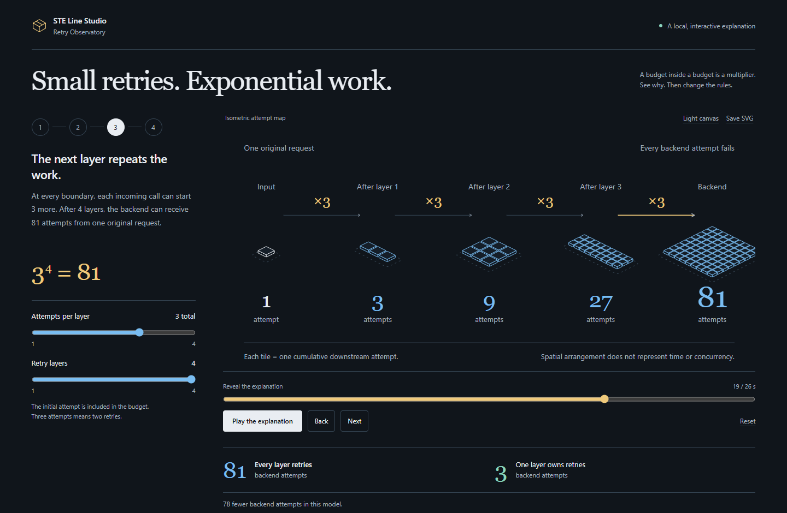
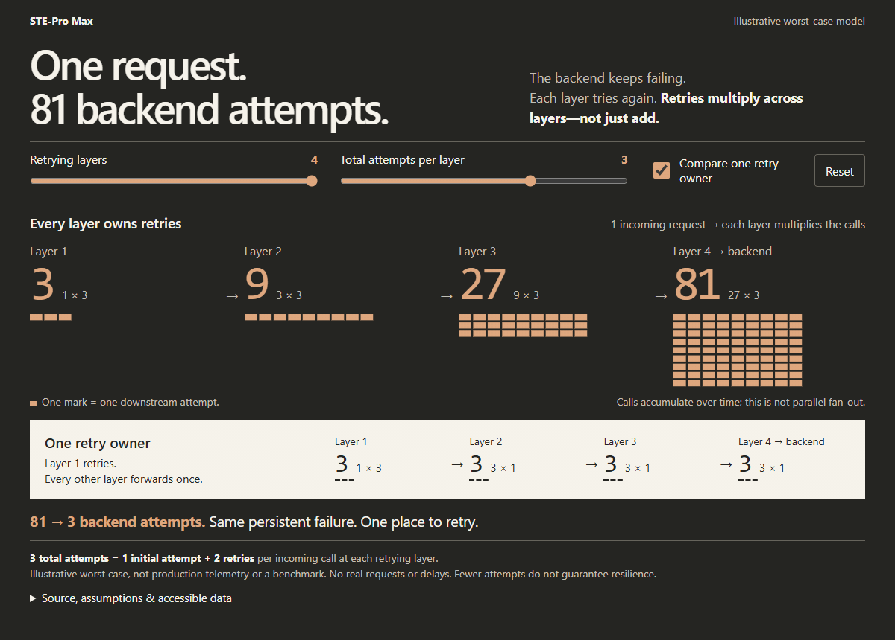
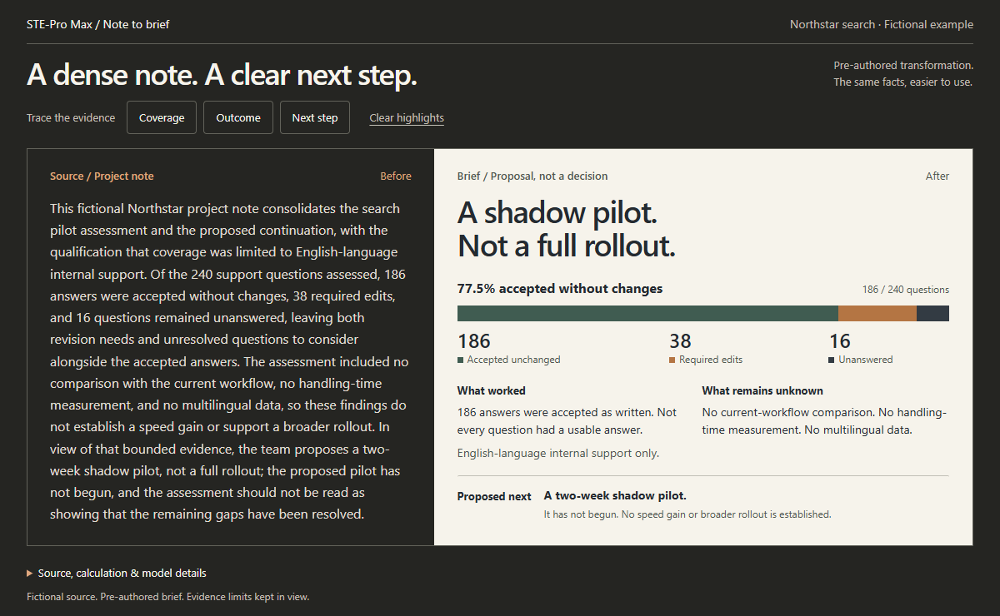
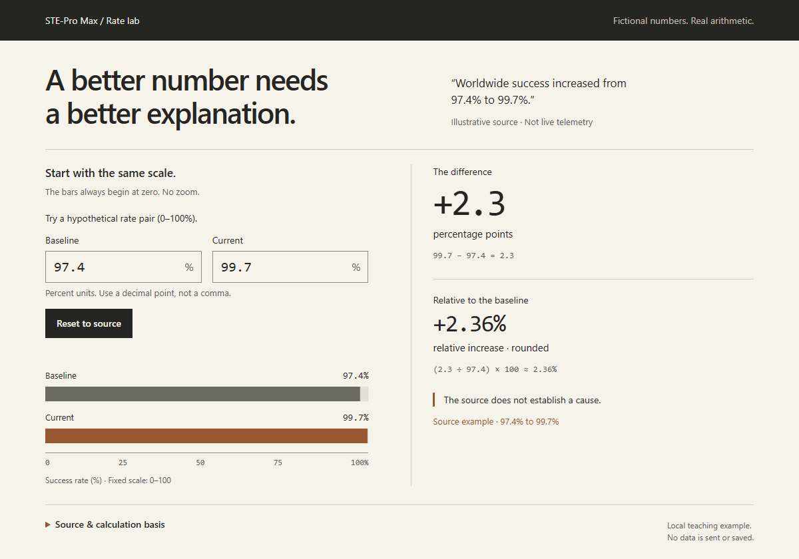

<p align="center">
  
</p>

# STE-Pro Max

**Stop shipping walls of text. Make complex ideas click.**

**STE-inspired clarity. Karpathy-inspired explanations.** Turn dense docs, systems,
and numbers into **sharp briefs, visual explanations, and interactive mini-labs**.

**GitHub Copilot · Claude Code · Codex.** Native plugin. No Python setup.

[STE](#ste-the-foundation) · [Karpathy](#karpathys-guidelines-put-to-work) · [Demos](#show-dont-tell) · [Install](#install-the-plugin) · [Docs](docs/README.md)

## STE: the foundation

**STE means Simplified Technical English**—a controlled language for technical
writing. Here: short sentences, consistent terms, clear instructions.
**Simpler language. Facts and uncertainty intact.**

> **Before:** “Prior to initiating deployment, verification of the configuration is required.”
>
> **STE:** “Check the configuration before you deploy.”

STE-inspired, not ASD-STE100 certification. [The approach](docs/APPROACH.md).

## Karpathy's guidelines, put to work

Our takeaways from [his post](https://x.com/karpathy/status/2105819303471976479):

- **Write clearly.** Use relaxed STE, not robotic prose.
- **Show the mechanism.** Use diagrams and images.
- **Make it explorable.** Use interactive HTML, controls, and animation.
- **Narrate when useful.** Bespoke explainers need a separately available media tool.
- **Build to explain.** Small, purpose-built software can make an idea tangible.

Choose the **smallest useful medium**. Keep the evidence inspectable.

## Show, don't tell

### Line Studio: see the mechanism

> “Make 81 → 3 explorable.”

[](examples/showcase/retry-observatory.html)

Play, scrub, change budgets, export SVG. [Explore](examples/showcase/retry-observatory.html) · [Guide](docs/LINE_STUDIO.md).

*Development preview—not in v0.4.0.*

### One request. 81 backend attempts.

> “Show me why retries multiply. Let me change the rules.”

[](examples/showcase/retry-storm.html)

Change the rules. Watch attempts multiply. [Explore](examples/showcase/retry-storm.html) · [Still](docs/assets/retry-storm.png).

### The update nobody reads → the brief everyone gets

> “Turn this pilot write-up into a one-screen briefing. Keep the evidence.”

[](examples/showcase/brief-transformation.html)

Trace the numbers, scope, and next step to their source. [Explore the brief](examples/showcase/brief-transformation.html).

### Don't just quote the number. Let people question it.

> “Explain 97.4% → 99.7%. Let me change the baseline.”

[](examples/showcase/rate-lab.html)

Move the inputs. See **percentage points vs. relative change** update together.
[Try the rate lab](examples/showcase/rate-lab.html).

**Working HTML, not UI mockups.** Fictional data and illustrative models.
[Get the examples](docs/EXAMPLES.md#get-the-files), open an HTML file, start exploring. No build or server.

## Install the plugin

Choose your agent. Install **v0.4.0**, restart it, and bring your own material.

<details open>
<summary><strong>GitHub Copilot CLI</strong></summary>

```sh
copilot plugin marketplace add shyamsridhar123/STE-Pro-Max#v0.4.0
copilot plugin install ste-pro-max@ste-pro-max-plugins
```

</details>

<details>
<summary><strong>Claude Code</strong></summary>

```sh
claude plugin marketplace add shyamsridhar123/STE-Pro-Max#v0.4.0
claude plugin install ste-pro-max@ste-pro-max-plugins
```

</details>

<details>
<summary><strong>Codex CLI</strong></summary>

```sh
codex plugin marketplace add shyamsridhar123/STE-Pro-Max --ref v0.4.0
codex plugin add ste-pro-max@ste-pro-max-plugins
```

</details>

> Use STE-Pro Max on this material. Make it clear, visual, and interactive where it helps.

[Host versions, updates & uninstall](docs/PLUGINS.md) · [More prompts](docs/EXAMPLES.md#steal-these-prompts)

[Documentation](docs/README.md) · [All examples](docs/EXAMPLES.md) · [Advanced engine](docs/AUTHORING.md) · [Apache-2.0](LICENSE)
